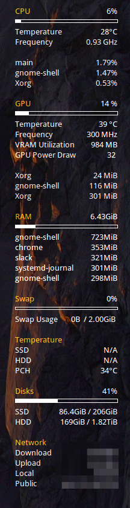

# System Monitor Revitalized

A neat and useful system monitor plugin for Conky. 

## Features: 

The UI Shows the following

- CPU Stats and Programs
- GPU1 Stats and Programs2
- RAM and VRAM1
- Swap Usage
- Temperature3
- Storage usage
- Network Speed
- IP

## Dependecies

1. **nvidia-smi**: Works only with Nvidia GPUs.

2. **python**: Requires running python script for GPU Processes to be shown. (Bundled in the repo)

3. **hddtemp** must be installed and configured to be run as a service: In `/etc/default/hddtemp` make sure `RUN_DAEMON="true"` is present.

## Screenshot

## Licence

Copyright (c) 2019 Saravanabalagi Ramachandran

- Not available for commercial use
- Absolutely no warranty provided

Permission is hereby granted, free of charge, to any person obtaining a copy of this software and associated documentation files (the "Software"), to deal in the Software without restriction, including without limitation the rights to use, copy, modify, merge, publish, distribute, sublicense, and/or sell copies of the Software, and to permit persons to whom the Software is furnished to do so, subject to the following conditions:

The above copyright notice and this permission notice shall be included in all copies or substantial portions of the Software.

THE SOFTWARE IS PROVIDED "AS IS", WITHOUT WARRANTY OF ANY KIND, EXPRESS OR IMPLIED, INCLUDING BUT NOT LIMITED TO THE WARRANTIES OF MERCHANTABILITY, FITNESS FOR A PARTICULAR PURPOSE AND NONINFRINGEMENT. IN NO EVENT SHALL THE AUTHORS OR COPYRIGHT HOLDERS BE LIABLE FOR ANY CLAIM, DAMAGES OR OTHER LIABILITY, WHETHER IN AN ACTION OF CONTRACT, TORT OR OTHERWISE, ARISING FROM, OUT OF OR IN CONNECTION WITH THE SOFTWARE OR THE USE OR OTHER DEALINGS IN THE SOFTWARE.
